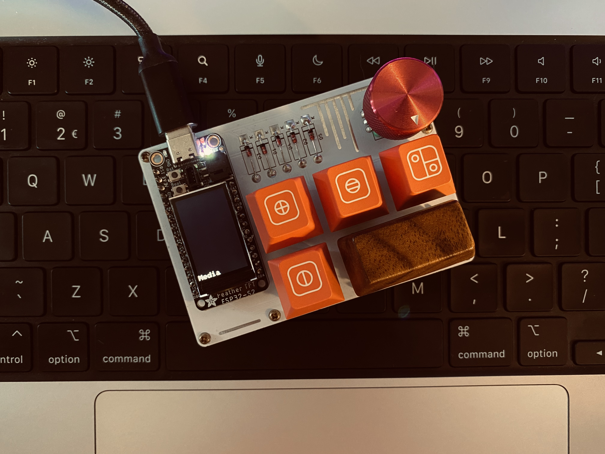

# Macropad

This project is to provide a QMK like environment for the ESP32-S2.

I've personally used an [Adafruit ESP32-S2 TFT Feather](https://www.adafruit.com/product/5300) for this project, just for the builtin display.

## Features

- [x] Keycodes
- [x] Layers
- [x] Display
- [x] Rotary encoders [*1](#iss-1)
- [x] MOD keys [*2](#iss-2)
- [x] Custom keys
- [ ] Layer keys
- [ ] Web configurator
- [ ] Macros
- [ ] Tapdances
- [ ] Combos

<a name="iss-1">*1</a>: This can be done using external libraries, currently the encoder values do not get read internally

<a name="iss-2">*2</a>: Mod keys only support one level of mods currently, so you cant use `LSHIFT(LCTRL(KC_Z))`

## Keycodes

Keycode               | Key
----------------------|------
\_\_\_\_              | NO
KC_NO                 | NO
KC_ROLL_OVER          | Roll over
KC_POST_FAIL          | Post fail
KC_UNDEFINED          | Undefined
KC_A                  | A
KC_B                  | B
KC_C                  | C
KC_D                  | D
KC_E                  | E
KC_F                  | F
KC_G                  | G
KC_H                  | H
KC_I                  | I
KC_J                  | J
KC_K                  | K
KC_L                  | L
KC_M                  | M
KC_N                  | N
KC_O                  | O
KC_P                  | P
KC_Q                  | Q
KC_R                  | R
KC_S                  | S
KC_T                  | T
KC_U                  | U
KC_V                  | V
KC_W                  | W
KC_X                  | X
KC_Y                  | Y
KC_Z                  | Z
KC_1                  | 1
KC_2                  | 2
KC_3                  | 3
KC_4                  | 4
KC_5                  | 5
KC_6                  | 6
KC_7                  | 7
KC_8                  | 8
KC_9                  | 9
KC_0                  | 0
KC_ENTER              | Enter 
KC_ESCAPE             | Esc
KC_BSPACE             | Backspace
KC_TAB                | Tab
KC_SPACE              | Space
KC_MINUS              | - or _
KC_EQUAL              | = or +
KC_LBRACKET           | [ or {
KC_RBRACKET           | ] or }
KC_BSLASH             | \\ or |
KC_NONUS_HASH         | # (non US)
KC_SCOLON             | ; or :
KC_QUOTE              | ' or "
KC_GRAVE              | ` or ~
KC_COMMA              | , or <
KC_DOT                | . or >
KC_SLASH              | / or ?
KC_CAPSLOCK           | Capslock
KC_F1                 | F1
KC_F2                 | F2
KC_F3                 | F3
KC_F4                 | F4
KC_F5                 | F5
KC_F6                 | F6
KC_F7                 | F7
KC_F8                 | F8
KC_F9                 | F9
KC_F10                | F10
KC_F11                | F11
KC_F12                | F12
KC_PSCREEN            | Print screen
KC_SCROLLLOCK         | Scrollback
KC_PAUSE              | Pause
KC_INSERT             | Insert
KC_HOME               | Home
KC_PGUP               | Page up
KC_DELETE             | Delete
KC_END                | End
KC_PGDOWN             | Page down
KC_RIGHT              | Right arrow
KC_LEFT               | Left arrow
KC_DOWN               | Down arrow
KC_UP                 | Up arrow
KC_NUMLOCK            | Numeric lock
KC_KP_SLASH           | keypad /
KC_KP_ASTERISK        | keypad *
KC_KP_MINUS           | keypad -
KC_KP_PLUS            | keypad +
KC_KP_ENTER           | keypad Enter
KC_KP_1               | Keypad 1
KC_KP_2               | Keypad 2
KC_KP_3               | Keypad 3
KC_KP_4               | Keypad 4
KC_KP_5               | Keypad 5
KC_KP_6               | Keypad 6
KC_KP_7               | Keypad 7
KC_KP_8               | Keypad 8
KC_KP_9               | Keypad 9
KC_KP_0               | Keypad 0
KC_KP_DOT             | Keypad .
KC_NONUS_BSLASH       | Keypad \ (non US)
KC_APPLICATION        | Application
KC_POWER              | Power
KC_KP_EQUAL           | Keypad =
KC_F13                | F13
KC_F14                | F14
KC_F15                | F15
KC_F16                | F16
KC_F17                | F17
KC_F18                | F18
KC_F19                | F19
KC_F20                | F20
KC_F21                | F21
KC_F22                | F22
KC_F23                | F23
KC_F24                | F24
KC_EXECUTE            | Execute
KC_HELP               | Help
KC_MENU               | Menu
KC_SELECT             | Select
KC_STOP               | Stop
KC_AGAIN              | Again
KC_UNDO               | Undo
KC_CUT                | Cut
KC_COPY               | Copy
KC_PASTE              | Paste
KC_FIND               | Find
KC_KB_MUTE            | Keyboard mute
KC_KB_VOLUME_UP       | Keyboard volume up
KC_KB_VOLUME_DOWN     | Keyboard volume down
KC_LOCKING_CAPS_LOCK  | Locking caps lock
KC_LOCKING_NUM_LOCK   | Locking numeric lock
KC_LOCKING_SCROLL_LOCK| Locking scroll lock
KC_KP_COMMA           | Keypad ,
KC_KP_EQUAL_AS400     | Keypad = AS400
KC_INTERNATIONAL_1    | International 1
KC_INTERNATIONAL_2    | International 2
KC_INTERNATIONAL_3    | International 3
KC_INTERNATIONAL_4    | International 4
KC_INTERNATIONAL_5    | International 5
KC_INTERNATIONAL_6    | International 6
KC_INTERNATIONAL_7    | International 7
KC_INTERNATIONAL_8    | International 8
KC_INTERNATIONAL_9    | International 9
KC_LANGUAGE_1         | Language 1
KC_LANGUAGE_2         | Language 2
KC_LANGUAGE_3         | Language 3
KC_LANGUAGE_4         | Language 4
KC_LANGUAGE_5         | Language 5
KC_LANGUAGE_6         | Language 6
KC_LANGUAGE_7         | Language 7
KC_LANGUAGE_8         | Language 8
KC_LANGUAGE_9         | Language 9
KC_ALTERNATE_ERASE    | Alternate erase
KC_SYSTEM_REQUEST     | System request
KC_CANCEL             | Cancel
KC_CLEAR              | Clear
KC_PRIOR              | Prior
KC_RETURN             | Return
KC_SEPARATOR          | Seperator
KC_OUT                | Out
KC_OPER               | Oper
KC_CLEAR_AGAIN        | Clear again
KC_CRSEL              | Clear selection
KC_EXSEL              | Exsel
KC_LCTRL              | Left control
KC_LSHIFT             | Left shift
KC_LALT               | Left alt
KC_LGUI               | Left gui
KC_RCTRL              | Right control
KC_RSHIFT             | Right shift
KC_RALT               | Right alt
KC_RGUI               | Right gui
KC_SYSTEM_POWER       | System power
KC_SYSTEM_SLEEP       | System sleep
KC_SYSTEM_WAKE        | System wake
KC_BRIGHTNESS_UP      | Brightness up
KC_BRIGHTNESS_DOWN    | Brightness down
KC_PLAY_PAUSE         | Play/Pause music
KC_NEXT_TRACK         | Next music track
KC_PREV_TRACK         | Previous music track
KC_MEDIA_STOP         | Stop music
KC_VOLUME             | Volume
KC_MUTE               | Mute
KC_VOLUME_INCREMENT   | Volume up
KC_VOLUME_DECREMENT   | Volume down